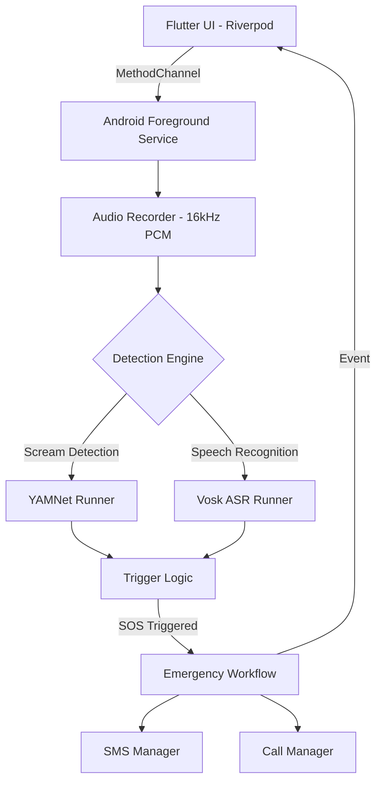

# 🛡️ ProteqHer: SOS Help Listener

[](https://flutter.dev)
[](https://www.android.com)
[](https://opensource.org/licenses/MIT)

**ProteqHer** is a high-reliability emergency response application designed to provide instant assistance when a user is in distress. By leveraging on-device Machine Learning and Android Foreground Services, it monitors for screams or distress calls even when the phone is locked or the app is in the background.

---

## ✨ Key Features

- 🎙️ **Always-Listening Detection**: Uses a combination of YAMNet (sound classification) and Vosk ASR (speech-to-text) to identify screams or the word "HELP".
- ⚙️ **Android Foreground Service**: Ensures the detection engine remains active in the background with minimal battery impact.
- 🚨 **Automated SOS Workflow**: 
  - Sends immediate SMS messages to all emergency contacts with a Google Maps location link.
  - Automatically initiates a phone call to the primary contact.
- 📍 **Precise Location**: Integrates GPS to provide real-time location data in emergency alerts.
- 📱 **Quick Triggers**: Home screen "EMERGENCY" and "MANUAL TRIGGER" buttons for instant manual activation.
- 💾 **Local Privacy**: All audio processing and contact storage (via Hive) happen entirely on-device.

---

## 🏗️ Architecture Overview

The project follows a clean architecture pattern, bridging Flutter's UI with native Android performance.



---

## 🛠️ Installation & Setup

### Prerequisites
- [Flutter SDK](https://docs.flutter.dev/get-started/install) (Stable channel recommended)
- Android Studio with SDK 33+ and platform tools
- A physical Android device (Required for microphone and background service testing)

### 1. Clone & Dependencies
```bash
git clone https://github.com/Thanfees/Emergency_auto_call.git
cd Emergency_auto_call
.\scripts\setup.bat  # Automated setup (Windows)
# OR
flutter pub get
```

### 2. ML Model Assets
Ensure the following files are present in `android/app/src/main/assets/`:
- `ml/yamnet.tflite` (The sound classification model)
- `vosk/vosk-model-small-en-us-0.15/` (The offline speech recognition engine)

### 3. Run the App
```bash
.\scripts\run.bat   # Quick run (Windows)
# OR
flutter run
```

---

## 🛡️ Permissions Required

To function as a life-saving tool, ProteqHer requires several critical permissions:

| Permission | Usage |
| :--- | :--- |
| **Microphone** | To listen for "HELP" or screams. |
| **SMS** | To send emergency alerts to contacts. |
| **Phone** | To initiate the emergency call. |
| **Location** | To include your real-time position in the SMS. |
| **Notifications** | To maintain the background foreground service. |

> [!IMPORTANT]
> **Battery Optimization**: On Android, you must set the app to **"Unrestricted"** battery usage in App Info to prevent the system from killing the background listener.

---

## 🔧 Developer Notes

### Voice Detection Rules
- **Trigger**: 3 detections within a 10-second window.
- **Window Reset**: If 10 seconds pass without reaching the threshold, the counter resets.
- **Debounce**: 2-second delay between detections to prevent duplicate triggers from a single shout.
- **Cooldown**: 60 seconds after a successful SOS trigger to prevent alert flooding.

### Testing
To run the domain logic tests:
```bash
flutter test
```

---

## 📝 License
Distributed under the MIT License. See `LICENSE` for more information.

---

## 🤝 Acknowledgments
- [Vosk](https://alphacephei.com/vosk/) for the offline ASR.
- [TensorFlow Hub](https://tfhub.dev/google/lite-model/yamnet/1/default/1) for the YAMNet model.
- [Riverpod](https://riverpod.dev/) for robust state management.
